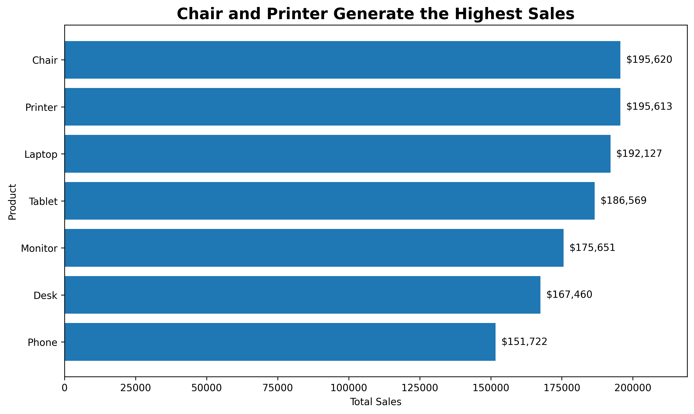
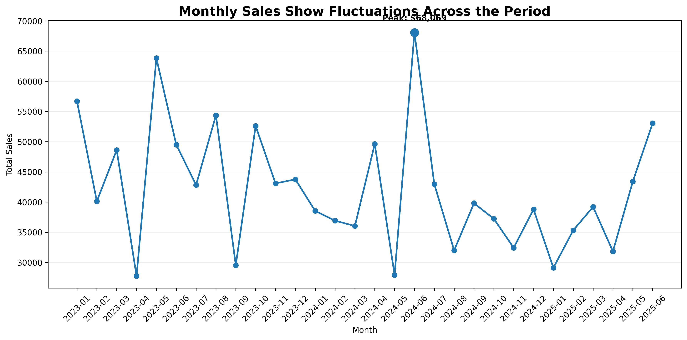
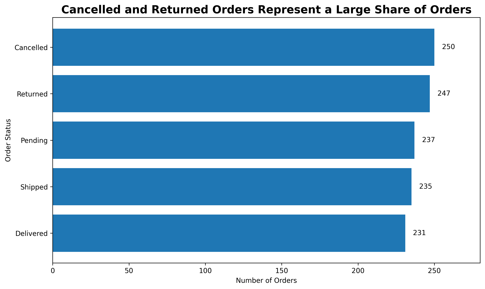
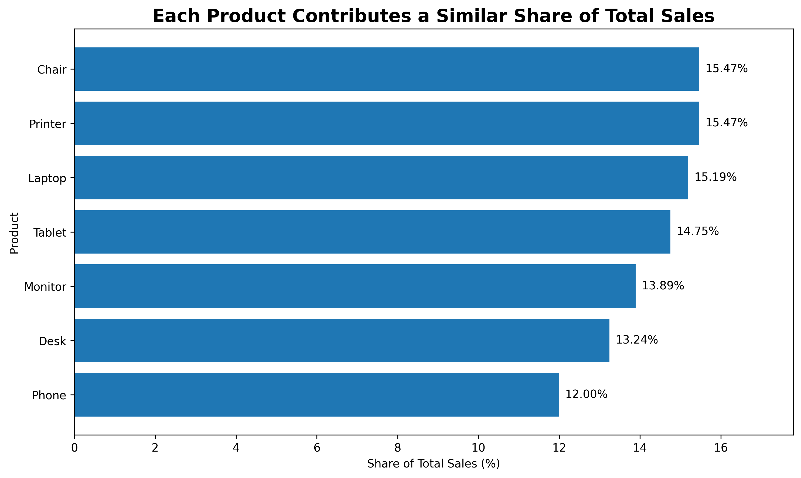

# DecodeLabs Project 4 – Data Visualization

## 📊 Project Overview

This project is part of the **DecodeLabs Data Analytics Industrial Training Kit – Project 4: Data Visualization**.

The objective was to transform raw order data into clear, purposeful visualizations and communicate meaningful insights through appropriate chart selection, titles, labels, and data storytelling.

The analysis was completed using **Python in Google Colab**, with Pandas for data preparation and Matplotlib for visualization.

---

## 📁 Dataset

The dataset contains **1,200 order records** and **14 variables** covering orders from **January 2023 to June 2025**.

### Key fields used

* `Date` – Order date
* `Product` – Product category
* `TotalPrice` – Total order value
* `OrderStatus` – Order status

---

## 📈 Visualizations Created

### 1. Sales by Product

**Chart type:** Horizontal Bar Chart

Compares total sales across the seven product categories.

**Key insight:** Chair and Printer generate the highest total sales, while Phone records the lowest total sales.

---

### 2. Monthly Sales Trend

**Chart type:** Line Chart

Shows monthly changes in total sales from January 2023 to June 2025.

**Key insight:** Monthly sales fluctuate throughout the period, with the highest-sales month highlighted directly on the chart.

---

### 3. Order Status Distribution

**Chart type:** Horizontal Bar Chart

Compares the number of orders across different order statuses.

**Key insight:** Cancelled and Returned orders represent a substantial share of the total orders.

---

### 4. Sales Contribution by Product

**Chart type:** Horizontal Bar Chart

Shows the percentage contribution of each product to total sales.

**Key insight:** The seven products contribute relatively similar shares of total sales, with no single product dominating the overall contribution.

---

## 🛠️ Tools & Technologies

* **Python**
* **Pandas**
* **Matplotlib**
* **Google Colab**
* **Microsoft Excel**

---

## 🎯 Visualization Principles Applied

The project applies fundamental data visualization and storytelling principles, including:

* Choosing charts according to the analytical question
* Using horizontal bars for category comparisons
* Using line charts for time-series trends
* Using clear, conclusion-focused titles
* Adding direct value labels where useful
* Reducing unnecessary visual elements
* Presenting one main message per visualization
* Highlighting important observations for faster interpretation

---

## 📂 Project Files

| File                                            | Description                             |
| ----------------------------------------------- | --------------------------------------- |
| `DecodeLabs_Project_4_Data_Visualization.ipynb` | Complete Google Colab analysis notebook |
| `01_Sales_by_Product.png`                       | Sales comparison by product             |
| `02_Monthly_Sales_Trend.png`                    | Monthly sales trend                     |
| `03_Order_Status.png`                           | Order status distribution               |
| `04_Sales_Contribution.png`                     | Product sales contribution              |

---

## 👩‍💻 Project Context

**Program:** DecodeLabs Industrial Training Kit
**Track:** Data Analytics
**Project:** Project 4 – Data Visualization
**Environment:** Google Colab

This project demonstrates practical skills in **data preparation, chart selection, visualization, insight generation, and data storytelling**.
